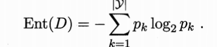
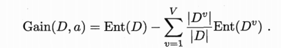
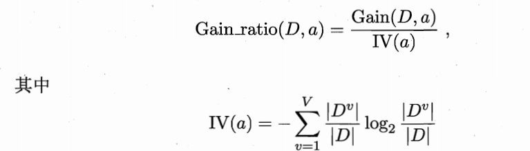
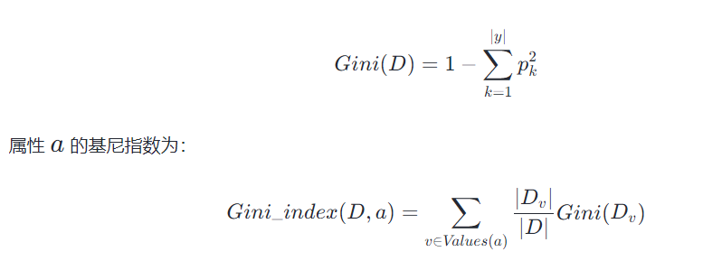

# 决策树
基本思想是根据某种原则每次选择一个属性作为划分依据，然后按属性的取值将数据集中的样本进行划分，是一种分类模型。

重点在于如何选择合适的属性进行划分
## 信息增益
 ID3

ID3算法通过信息增益选择划分属性。信息增益基于信息熵计算：
信息熵定义：

信息增益

一般而言，信息增益越大，则意味着使用属性a 来进行划分所获得的“纯度提升”越大.因此，我们可用信息增益来进行决策树的划分属性选择。
## 增益率
信息增益准则对可取值数目较多的属性有所偏好，为减少这种
偏好可能带来的不利影响，著名的C4.5决策树算法[Quinlan, 1993]不直接使
用信息增益，而是使用“增益率”(gain ra tio )来选择最优划分属性.

## 基尼指数
CART 决 策 树 [Breiman et a l, 1984]使 用 “基 尼 指 数 "(Gini index)来选
择划分属性.采用与式(4.1)相同的符号，数据集。 的纯度可用基尼值来度量.
G in i(P)反映了从数据集D 中随机抽取两个样本，其类别标记
不一致的概率.因此,Gini(D)越小，则数据集D 的纯度越高.

# 剪枝、连续值与缺失值处理
## 剪枝
缓解出现过拟合
* 预剪枝  
在构造过程中评估节点是否需要分支，如果分支对模型性能没有提升，则不进行分支。

* 后剪枝  
构造完整决策树后，从底向上评估分支的必要性，如果分支对模型性能没有提升，则剪掉该分支。
## 连续值、缺失值处理
连续属性离散化技术可派上用场.最简单的策
略是采用二分法(bi-partition)对连续属性进行处理。

缺失值处理，若是标记缺失，则抛弃样本，否则，可以采取相应的填充手段，权重划分。