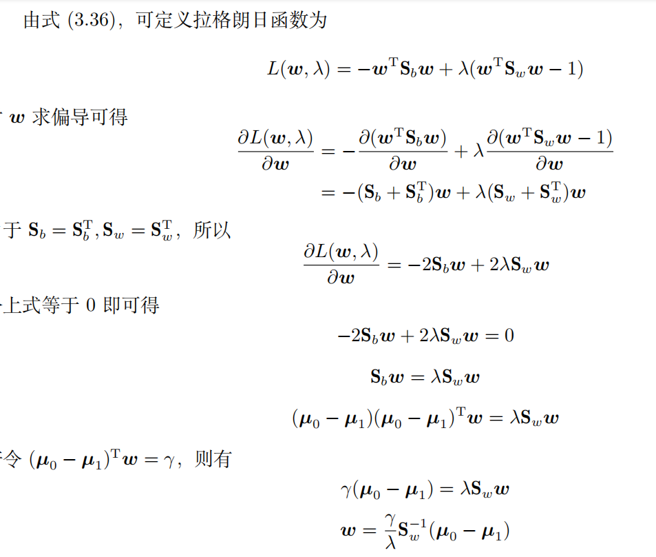

# 线性判别分析
“Fisher判别法”，方法的思想非常朴素，给定训练样例集，设法将样例投影到一条直线上,使得同类样例的投影点尽可能接近、异类样例的投影点尽可能远离；在对新样本进行分类时，将其投影到同样的这条直线上，再根据投影点的位置来确定新样本的类别。

模型$y=w^Tx$

关键就在于如何在数据上学习到$w^T$这个投影基线，因此，需要要找到可以定量衡量所谓“尽可能近，尽可能远”，以便我们获取目标函数进行优化。

目标函数如下：

接下来的工作便是如何确定w了

