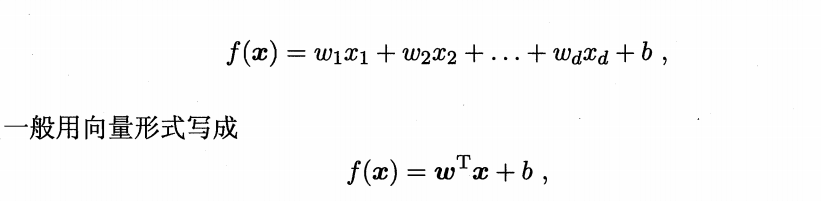
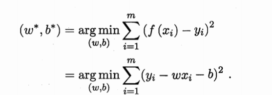
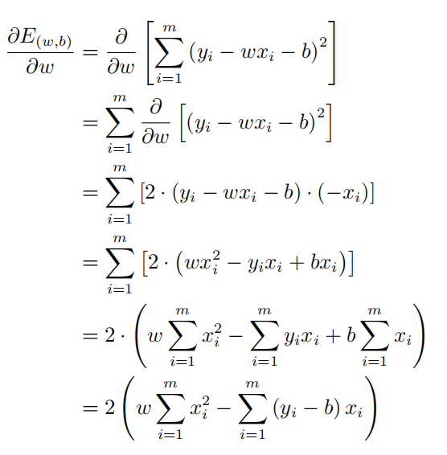
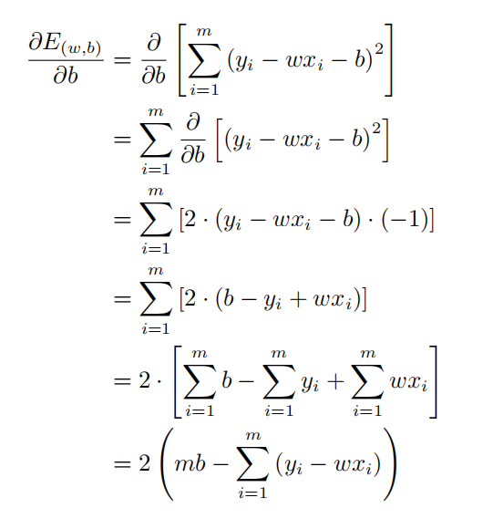
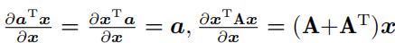
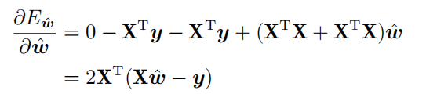
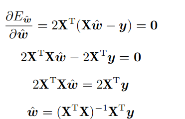

# 线性模型
线性模型试图学得一个通过属性的线性组合进行预测的函数，一般形式为：

其中w是一个列向量
机器学习最终希望学习到一个误差最小的数学表达，因此如何定义线性模型的误差决定了我们如何求解模型参数。
* 均方误差
均方误差有非常好的几何意义，它对应了常用的欧几里得距离或简称“欧
氏 距 离 "(Euclidean distance).即预测f(x)与目标y之间的欧氏距离。

对均方误差求最小值，误差函数即为
$(f(x_i)-y_i)^2$
对所有样本点累加，并对最终的函数反求最小值点，即为：

这里E(w,b)是关于w和b 的凸函数，当它关于w和b 的导数均为零时，得到w和 b 的最优解.

线性回归是一个特例,对于这样的凸优化，存在着闭式解，因此，可以直接通过计算得到，而不需要通过逼近寻找数值解。
下面对上式进行求解：
* 首先对误差函数E(w,b)进行求导，过程如下  

然后分别令其等于0，，令$0=w\sum_{i=1}^{m}x_i^2-\sum_{i=1}^{m}(y_i-b)x_i$
如图![]
(3.5.png)
以上就是一元线性回归的求解，拓展到多元的情况下，将偏置量b同样写入参数矩阵，对数据矩阵多加一行恒为1的列，所有的过程都是类似的，但需要引入多元函数相关知识。
此处的误差函数将写为向量内积的形式：$(y-Xw)^T(y-Xw)$,此处的w为求解出的w。

矩阵微分公式：

有了矩阵的微分公式，就能对向量形式的多元函数进行求导了

对w进行求导

置零，得出结果$w=(X^TX)^{-1}X^Ty$

注意，在多元函数中，需要通过 Hessian 矩阵的正定性判断是否为凸函数，只有凸函数，才能找到全局最优，也就是闭式解。
